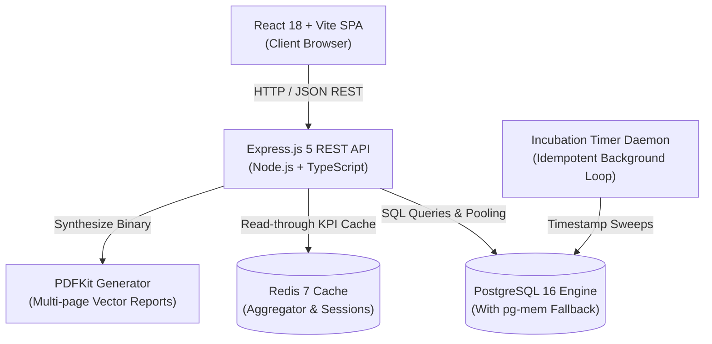

# MicroLIMS System Architecture & Technical Design

## 1. System High-Level Topology



---

## 2. Layered Architecture

MicroLIMS follows a clean modular architectural pattern:

```text
src/
├── app.ts                  # Middleware pipeline, CORS, Helmet, JSON parser, Route mounts
├── server.ts               # HTTP server lifecycle, database boot, daemon starter
├── middleware/             # Cross-cutting concerns
│   ├── auth.middleware.ts  # JWT verification and user population
│   ├── rbac.middleware.ts  # Role authorization enforcement
│   ├── audit.middleware.ts # Automatic forensic event logging
│   └── validate.middleware.ts # Zod schema validation
└── modules/
    └── [domain]/
        ├── [domain].dto.ts        # Input validation schemas & interfaces
        ├── [domain].repository.ts  # Database queries & mapped entities
        ├── [domain].service.ts     # Business logic, state machines, audit events
        ├── [domain].controller.ts  # Request extraction & standard JSON responses
        └── [domain].routes.ts      # Express endpoint routing with RBAC guards
```

---

## 3. Specimen State Machine Progression

MicroLIMS enforces a strict specimen diagnostic progression state machine:

```text
REGISTERED ──> ACCESSIONED ──> IN_TESTING ──> TESTING_COMPLETE ──> UNDER_REVIEW ──> APPROVED ──> FINALIZED
      │              │              │                 │                  │              │
      └──────────────┴──────────────┴─────────────────┴──────────────────┴──────────────┴──> CANCELLED
```

### Transition Invariants:
1. Specimens cannot jump directly from `ACCESSIONED` to `FINALIZED`.
2. Specimens with active `QUARANTINE` or pending contamination investigations are blocked from approval.
3. `FINALIZED` specimens are immutable; any subsequent clinical corrections require an official `AMENDMENT` addendum with forensic change reasons.

---

## 4. Cryptographic Electronic Sign-off & PDF Checksum

1. **Sign-off Payload Hashing**:
   When an authorized Reviewer executes sign-off, a SHA-256 digest is calculated over:
   `sample_id + stage + decision + signer_name + signer_title + reviewer_id + reviewed_at_iso`
2. **Tamper-Evident Diagnostic Report**:
   When the multi-page PDF is rendered via PDFKit, the exact generated binary buffer is hashed using `crypto.createHash('sha256')`. The resultant 64-character hexadecimal digest is recorded immutably in the `reports` table.
3. **Public Verification**:
   The `/api/v1/reports/verify` endpoint compares submitted checksums against the database records to mathematically prove report integrity and provenance.
